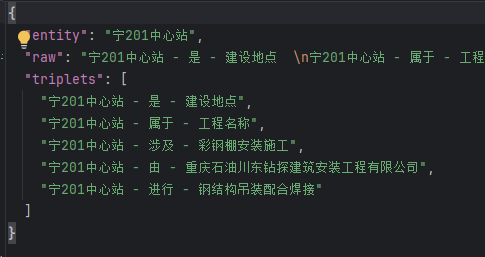

**宁201中心站生活污水处理装置升级改造彩钢棚安装施工方案**

**编制人：**

**审核人：**

**批准人：**

**重庆石油川东钻探建筑安装工程有限公司**

**2025年12月**

目录

目录

[第一章 编制依据 3](#__RefHeading___Toc214547342)

[**1.1 文件依据** 4](#__RefHeading___Toc214547343)

[**1.2 其他依据** 4](#__RefHeading___Toc214547344)

[第二章 工程概况 4](#__RefHeading___Toc214547345)

[**2.1工程名称** 4](#__RefHeading___Toc214547346)

[**2.2建设地点** 4](#__RefHeading___Toc214547347)

[**2.3开完工时间** 4](#__RefHeading___Toc214547348)

[**2.3参建单位** 4](#__RefHeading___Toc214547349)

[第三章 施工准备与资源配置计划 4](#__RefHeading___Toc214547350)

[**3.1施工准备** 5](#__RefHeading___Toc214547351)

[**3.2资源配置计划** 5](#__RefHeading___Toc214547352)

[**3.3主要工作量** 9](#__RefHeading___Toc214547353)

[第四章 施工安排 11](#__RefHeading___Toc214547354)

[**4.1施工顺序** 11](#__RefHeading___Toc214547355)

[**4.2施工重难点管理** 12](#__RefHeading___Toc214547356)

[第五章 健康、安全、环保管理 12](#__RefHeading___Toc214547357)

[**5.1工作前风险分析** 12](#__RefHeading___Toc214547358)

[**5.2风险控制措施** 12](#__RefHeading___Toc214547359)

**第二章**编制依据

### **1.1 文件依据**

* + 1. SY/T4200-2022《油气田地面工程土建施工规范》
    2. 2.《建筑施工高处作业安全技术规范》（JGJ80-2016）
    3. 3.《钢结构工程施工质量验收标准》（GB50205-2020）
    4. 4.《建筑施工动火作业安全技术规范》（JGJ308-2014）
    5. 5.《石油化工建设工程施工安全技术标准》（GB/T50484-2019）
    6. 6.重庆川东石油安装建筑工程有限公司安全管理体系文件及施工组织设计

### **1.2 其他依据**

根据对施工现场踏勘调查。

**第三章**工程概况

### **2.1工程名称**

### 宁201中心站生活污水处理装置升级改造彩钢棚安装

### **2.2建设地点**

宁201中心站

### **2.3开完工时间**

计划开始时间：2025年 12 月 8 日；计划完成时间：2025年 12 月 11日。

### **2.3参建单位**

施工单位：重庆石油川东钻探建筑安装工程有限公司

**第四章**施工准备与资源配置计划

### **3.1施工准备**

3.1.1技术准备

1.申请人与属地监督共同确认作业环境安全条件是否满足作业要求；

2.项目负责人组织申请人、作业相关人员、属地开展安全技术交底，详细说明作业内容、作业风险、控制措施，确保相关人员清楚以上内容，严格落实作业过程中的各项安全措施；

3.属地及申请人应在作业过程中严格监督、提醒作业人员，避免意外伤害的发生。

3.1.2现场准备

### 1.检查到场作业人员、材料、机具是否与方案一致；

### 2.申请人与属地监督共同确认作业环境安全条件、状况是否满足作业要求；

### 3.申请人组织作业人员、属地开展安全技术交底，说明作业内容、作业风险、控制措施。

### **3.2资源配置计划**

人员配置：

现场负责人：闫加强（安全监护人） 电话15681767989

辅助民工： 6人

特种作业人员：陈小林： 焊工、登高 证件号T511528199311135638

陈孝闯： 焊工、登高 证件号T212533198010283810

冉朝友： 电工 证件号T512533196512143835

龚 兴 吊车司机 证件号 511526199308243811

王尚均 司索 证件号 512533196510084616

陈小林 焊工与高空：

陈孝闯 焊工与高空：

冉朝友 电工：

龚 兴 吊车司机

王尚均 司索

吊车

 

**主要设备、材料和施工辅助材料需要量**

| **序号** | **规格型号** | **单位** | **数量** | **备 注** |
| --- | --- | --- | --- | --- |
| **一** | 主要设备、材料 |  |  |  |
| 1 | 焊机 | 台 | 1 |  |
| 2 | 配电箱 | 个 | 1 |  |
| 3 | 发电机 | 台 | 1 |  |
| 4 | 锂电池角磨机 | 台 | 3 |  |
| 5 | 电扳手 | 把 | 2 |  |
| 6 | 灭火器 | 瓶 | 2 |  |
| 7 | 扳手 | 套 | 2 |  |
| 9 | 电钻 | 把 | 2 |  |
| 10 | 电镐 | 把 | 2 |  |
| 11 | 护目镜 | 副 | 2 |  |
| 12 | 焊条 | 公斤 | 5 |  |
| 13 | 焊丝 | 公斤 | 5 |  |
| 14 | 25T流动式起重机 | 台 | 1 |  |
| 二 | 辅助材料 |  |  |  |
| 1 | 警示带 | 卷 | 1 |  |
| 2 | 医疗箱 | 个 | 1 |  |
| 3 | 生命绳Φ20 | M | 30 |  |
| 4 | 全身式安全带 | 套 | 2 |  |
| 5 | 牵引绳Φ12 | 米 | 50 |  |

**施工人员配置**

| **序号** | **专业岗位** | **工种** | **人数** | **备 注** |
| --- | --- | --- | --- | --- |
| **一** | 高空、焊工作业岗 | 高空、焊工 | 2人 |  |
| 二 | 电气作业岗 | 低压电工 | 1人 |  |
| 三 | 特种作业岗位（起重机械操作类） | 吊车司机 | 1人 |  |
| 四 | 特种作业岗位（起重信号司索类） | 司索工 | 1人 |  |

### **3.3主要工作量**

宁201生活污水处理装置升级改造彩钢棚安装施工

1. 2025年12月8号钢结构吊装配合安装

2.2025年12月9号-2025年12月11彩钢板铺设

25T吊车性能表

QY25A汽车起重机重能力参考表

|  |  |  |  |  |  |  |
| --- | --- | --- | --- | --- | --- | --- |
| 臂长/m | 10.2 | | 17.6 | | 25 | |
| 工作幅度/m | 起升高度/m | 起重量/t | 起升高度/m | 起重量/t | 起升高度/m | 起重量/t |
| 3.2 | 10.0 | 25.0 |  |  |  |  |
| 3.5 | 9.83 | 25.0 | 17.75 | 15.8 |  |  |
| 4.0 | 9.55 | 23.0 | 17.60 | 14.3 |  |  |
| 4.5 | 9.23 | 21.0 | 17.43 | 13.1 |  |  |
| 5.0 | 8.86 | 19.0 | 17.25 | 12.1 | 25.0 | 9.6 |
| 5.5 | 8.45 | 17.0 | 17.05 | 11.2 | 24.87 | 8.8 |
| 6.0 | 7.98 | 15.0 | 16.84 | 10.4 | 24.73 | 8.2 |
| 7.0 | 6.79 | 12.35 | 16.35 | 9.1 | 24.4 | 7.1 |
| 8.0 | 5.1 | 10.2 | 15.77 | 8.0 | 24.03 | 6.2 |
| 9.0 |  |  | 15.11 | 7.1 | 23.6 | 5.5 |
| 10.0 |  |  | 14.34 | 6.38 | 23.13 | 4.9 |
| 11.0 |  |  | 13.35 | 5.62 | 22.59 | 4.4 |
| 12.0 |  |  | 12.38 | 4.93 | 22.0 | 4.0 |
| 14.0 |  |  | 9.59 | 3.25 | 20.61 | 3.3 |
| 16.0 |  |  | 4.29 | 2.95 | 18.9 | 2.7 |
| 18.0 |  |  |  |  | 16.75 | 2.25 |
| 20.0 |  |  |  |  | 13.97 | 1.84 |
| 22.0 |  |  |  |  | 9.99 | 1.43 |

此次吊装彩钢棚主体，吊装作业半径大约在5米，根据25吨吊车性能表得知，在作业半径5米吊臂18米时，起吊重量可达到17吨，本次被吊物品最重为1吨左右，吊车选用满足本次吊装需求，施工时司索工和属地、项目负责人应在现场指挥监督到位，特别是吊装前吊车及钢索检查到位，吊前做好试吊工作，被吊物两端应绑扎牵引绳，以保证整个作业安全。

**第五章**施工安排

**4.1施工顺序**

风险作业目录编号：风险作业目录编号：CN-TY-A05，CN-TY-A06，CN-TY-A13

施工顺序安排：

1. 对照施工方案，人、机、环作业前检查符合性，设备机具的完好状况，线缆的外表绝缘层情况；
2. 开工前项目负责人组织作业人员、属地人员、申请人、相关方进行安全技术交底共同确认具备开工条件并签字确认作业票移交属地
3. 对201生活污水处理装置升级改造钢结构吊装配合焊接
4. 焊接完成后安装彩钢棚
5. 作业完成后属地与申请人对照作业票确认作业已完成有无遗漏并对现场进行安全检查确认现场无安全隐患进行签字并关闭票证

**4.2施工重难点管理**

4.4.1施工重难点

1.彩钢结构焊接（动火作业）

2.焊接完成安装彩钢棚（高处作业）

4.4.2施工组织机构及技术措施

技术措施：

1. 清理5M以内可燃物，设置警戒区，避免恶劣天气。
2. 人员持有效证件上岗，配全身式安全带、防滑鞋。
3. 设备、工具合理放置，确保安全距离。

**第六章**健康、安全、环保管理

### 5.1工作前风险分析

|  |  |  |  |  |
| --- | --- | --- | --- | --- |
| 序号 | 施工步骤 | 涉及作业类型 | 主要风险 | 可能造成的伤害 |
| 1 | 施工准备（设备检查、物料堆放） | 设备调试、物料搬运 | 机械故障、物体坍塌 | 机械划伤、砸伤、挤压伤 |
| 2 | 钢结构吊装配合安装 | 起重作业、高处作业 | 起重伤害、高处坠落、物体打击 | 人员伤亡、骨折、设备损坏 |
| 3 | 钢结构焊接 | 动火作业、临时用电 | 火灾、触电、高温灼伤 | 灼伤、触电伤亡、财产损失 |
| 4 | 彩钢板铺设 | 高处作业 | 高处坠落、物体打击 | 物体打击|摔伤、砸伤、构件挤压伤 |

5.2风险控制措施

一、物体打击风险控制措施

1. 作业区域采用警示带+警示标识双重隔离，设置专人全程监护，严禁非作业人员进入，隔离范围需覆盖吊装半径外延3米区域。

2. 作业人员必须正确佩戴安全帽（帽衬与帽壳间距2-4cm）、防冲击护目镜，高处作业人员额外系挂工具袋，所有小型工具（扳手、螺丝刀等）必须拴挂安全绳。

3. 吊装构件下方严禁站人或通行，构件起吊至离地面10-20cm时，暂停起吊，检查捆绑牢固性后再继续作业。

4. 彩钢板、钢结构件等物料堆放整齐，底部垫设枕木（高度≥10cm），避免堆叠过高（单层高度≤1.5m），防止坍塌滑落。

5. 操作时动作轻缓，避免野蛮施工，构件对接、安装时需缓慢调整位置，严禁抛掷物料或工具。

二、火灾风险控制措施

1. 动火作业前必须办理动火许可证，清理作业点5米范围内所有可燃物（包括油污、木屑、油漆桶等），无法清理的可燃物需用防火毯覆盖隔离。

2. 现场配置2具干粉灭火器（MFZ/ABC4型），放置在动火点上风侧1.5-3米处，确保完好有效，作业人员需熟练掌握灭火器使用方法。

3. 动火作业实行“一人动火、一人监护”制度，监护人员全程坚守岗位，作业结束后留守30分钟，确认无复燃风险后方可离开。

4. 电气设备（焊机、配电箱、发电机）需放置在干燥通风处，远离易燃物，线缆铺设采用绝缘套管保护，避免碾压、磨损，定期检查绝缘层完整性。

5. 严禁在作业区吸烟、违规使用明火，现场禁止存放易燃易爆物品（如汽油、酒精等），如需使用需单独设置隔离存放区。

三、高温灼伤/烫伤风险控制措施

1. 焊机、热管道等高温设备需加装隔热防护套，作业前检查防护套是否完好，无破损、脱落情况。

2. 接触高温物件（焊接件、焊条头、设备外壳）时，必须佩戴防烫手套（耐温≥500℃）、护目镜，严禁徒手触碰。

3. 焊接作业时设置防护挡板，避免弧光灼伤皮肤和眼睛，作业人员穿戴阻燃工作服、防护面罩。

4. 高温作业区域设置遮阳棚，配备饮用水和降温用品，作业时间避开正午高温时段（11:00-15:00），单次作业时长不超过1小时，轮换休息。

5. 作业后待高温设备/物件自然冷却至室温（≤40℃）后再移动或存放，焊条头集中放入专用防火桶，严禁随意丢弃。

四、触电风险控制措施

1. 所有电气设备必须接地接零，接地电阻≤4Ω，配电箱安装漏电保护器（动作电流≤30mA，动作时间≤0.1s），每日作业前检查漏电保护器有效性。

2. 线缆需选用防水、阻燃型，无破损、老化、龟裂现象，穿越道路时需加设防护套管并固定牢固，避免碾压。

3. 作业人员穿戴绝缘手套、绝缘鞋，严禁赤手操作电气设备，潮湿环境作业时额外采取绝缘隔离措施（如铺设绝缘垫）。

4. 发电机、配电箱等设备由持证电工专人操作和管理，严禁非电工接线、拆线或维修，作业时断电挂牌，防止误操作。

5. 定期检查电气设备接线端子、插头插座，避免松动、氧化，遇雷雨天气立即停止用电作业，切断电源，人员撤离至安全区域。

五、机械伤害风险控制措施

1. 作业前检查工器具（角磨机、电扳手、电钻等）的防护罩、手柄、开关是否完好，传动部位无裸露，试运转正常后方可使用。

2. 操作机械时佩戴布手套（严禁佩戴线手套操作旋转类机械），长发需盘入安全帽内，避免卷入传动部位。

3. 角磨机、电镐等手持机械需安装防滑手柄，作业时保持稳定姿势，避免用力过猛导致设备失控，打磨、切割作业时设置防护挡板。

4. 机械工具专人保管，定期维护保养，存放于干燥通风处，避免雨淋、受潮，损坏工具及时维修或更换，严禁带病作业。

5. 多人协同作业时，明确分工，统一指挥，避免交叉操作导致机械碰撞或误触发。

六、高处坠落风险控制措施

1. 作业人员必须年满18周岁，无高血压、心脏病、恐高症等疾病，饮酒、疲劳状态下严禁参与高处作业，上岗前进行健康确认。

2. 佩戴安全帽（帽带系紧）、全身式双钩安全带，安全带高挂低用，挂钩挂在独立安全绳或牢固的钢结构上，严禁挂在临时构件或易碎部位。

3. 高空作业平台（脚手架、吊篮）需搭设牢固，脚手板铺满绑牢，无探头板（探头长度≤15cm），平台护栏高度≥1.2m，底部设挡脚板。

4. 构件临时固定需设置2个以上独立支撑点，支撑点承载力≥构件重量的1.5倍，待永久连接（焊接、螺栓紧固）完成并验收合格后，方可松钩。

5. 遇6级以上大风（风速≥10.8m/s）、雷雨、大雾等恶劣天气，立即停止高处作业，人员撤离至地面安全区域，作业前清理平台上的杂物，避免滑落伤人。

七、起重伤害风险控制措施

1. 吊车司机、司索工必须持有效特种作业操作证上岗，作业前核对吊车性能参数（25T流动式起重机），确保作业半径、臂长与起重量匹配（作业半径5米时，起重量≤17吨，本次吊装货物最重≤1吨）。

2. 吊车支腿完全伸出，支腿下方铺垫枕木（尺寸≥50cm×20cm×10cm），确保地面平整坚实，承载力≥吊车总重量（39.2吨）的1.2倍，作业前检查支腿伸缩是否正常。

3. 司索工按规范捆绑吊物，选用合格吊索（安全系数≥6），捆绑点避开锋利棱角（加设护角），吊物重心居中，确保吊装平衡，被吊物两端绑扎牵引绳（长度≥5米），控制吊物摆动。

4. 吊装前进行试吊，吊物起吊至离地面10-20cm时，停留3-5分钟，检查吊车稳定性、吊索受力情况，无异常后方可正式起吊。

5. 吊装过程中，司索工、现场负责人全程监护，保持与吊车司机的有效沟通（手势、对讲机），严禁人员进入吊装半径范围内，吊物下方禁止站人或作业，遇突发情况（如设备异常、天气变化）立即停止吊装，采取应急措施。